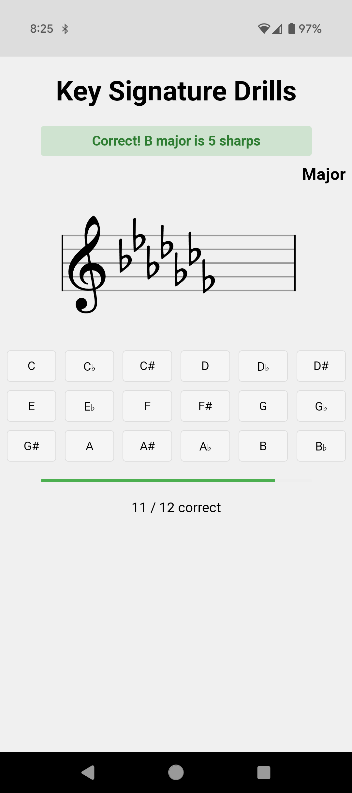

# key-signature-flashcard-drills-pwa
## Description

The program I used to learn keysignatures (http://www.imusicbuddy.com/) disappeared from the Android store between phones.
I thought it was a useful and simple program and decided to recreate the key signature drills as an installable
progressive web app (I hadn't gotten to fully learning the minor key signatures yet).

This was mostly written by AI. My front-end skills are extremely rusty and I was curious to see if I could get to something fully working
just via chat prompts. It works in my testing, but I'm sure has some edge missed cases.

It displays random signatures for 5 minutes, allowing the choice of Major, Minor, or both.

## To-do

- [ ] The old app seemed to favor pulling in what you recently got wrong, add logic for that
- [ ] Use storage to track progress
